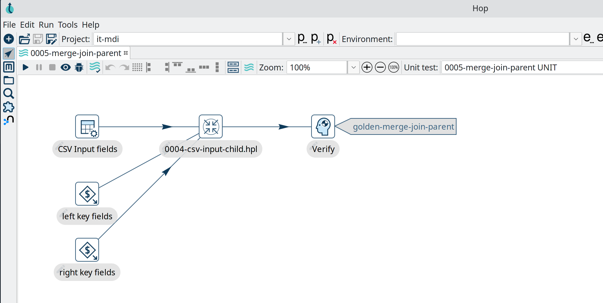

# Hop CI/CD pipeline

Deploy Hop server with CI/CD on Elestio

 
 

# Once deployed ...

You can open Hop ADMIN UI here:

    URL: https://[CI_CD_DOMAIN]
    login: root
    password: [ADMIN_PASSWORD]

# Important

To persist all your files, you'll have to save them in `/project` folder.
